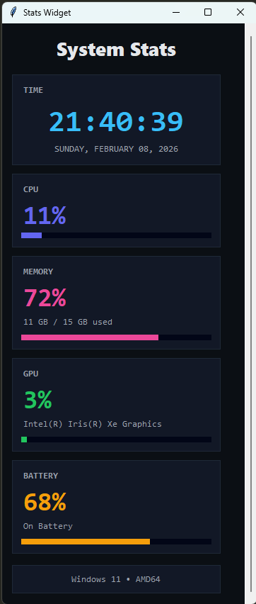

# System Stats Widget

 

A lightweight system monitoring widget for Windows that displays CPU, RAM, GPU, and battery stats in real-time with a clean, modern interface.

## 📥 Download & Installation

### Quick Start (For Users):
1. **Download**: [SystemStats.exe](SystemStats.exe) (Latest Release)
2. **Unblock**: Right-click the file → **Properties** → Check **"Unblock"** → **Apply**
3. **Run**: Double-click `SystemStats.exe`

> ⚠️ **Note**: Windows Defender may flag this as unsafe because it's not digitally signed. This is a **false positive**. You can inspect the source code below to verify its safety.

## 🚀 Features
- ✅ **Real-time Monitoring**: CPU, RAM, GPU, and battery usage
- ✅ **System Information**: Time, date, and Windows version
- ✅ **Always on Top**: Stays visible above other windows
- ✅ **Scrollable Interface**: View all stats in a compact window
- ✅ **GPU Support**: Both discrete (NVIDIA/AMD) and integrated GPUs
- ✅ **Dark Theme**: Easy on the eyes during long sessions

## 🐛 Troubleshooting

If you encounter any issues:

1. **"Windows protected your PC" warning**: 
   - Click **"More info"** → **"Run anyway"**
   - Or follow the unblock instructions above

2. **App won't start**:
   - Try running as Administrator (Right-click → Run as administrator)
   - Check if your antivirus is blocking the executable

3. **Missing GPU stats**:
   - For NVIDIA GPUs: Install the latest drivers
   - For integrated graphics: Windows Performance Counters should work automatically

## 🔧 For Developers

Want to modify or build from source?

### Prerequisites
- Python 3.8 or higher
- pip (Python package manager)

### Installation

**Option 1: Using requirements.txt** (Recommended)
```bash
pip install -r requirements.txt
```

**Option 2: Manually installing**
pip install psutil==5.9.8
pip install GPUtil==1.4.0  # Optional for GPU monitoring


# Create virtual environment
python -m venv venv

# Activate on Windows
venv\Scripts\activate

# Activate on macOS/Linux
source venv/bin/activate

# Install dependencies
pip install -r requirements.txt

# Running from source
python system_stats.py